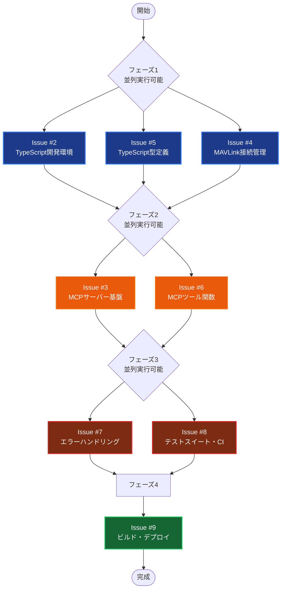

# Python MCPサーバー → TypeScript変換ロードマップ

## 作業フロー図



## 実行順序と優先度

### フェーズ1（並列実行可能）- 推奨開始順序
1. **Issue #5** (TypeScript型定義) - 🔴 最優先
   - 他の実装の基盤となる
   - MAVLinkプロトコル、MCP用型定義
   
2. **Issue #2** (TypeScript開発環境) - 🟡 次優先
   - package.json、tsconfig.json
   - ESLint、Prettier設定
   
3. **Issue #4** (MAVLink接続管理) - 🟢 同時実行可能
   - node-mavlink統合
   - 接続管理クラス実装

### フェーズ2（並列実行可能）
1. **Issue #3** (MCPサーバー基盤) - 🔴 先に開始
   - @modelcontextprotocol/sdk-typescript
   - ArduPilotMcpServerクラス
   
2. **Issue #6** (MCPツール関数) - 🟡 依存実行
   - 6つのツール関数実装
   - MCPサーバーの進捗に応じて開始

### フェーズ3（並列実行可能）
1. **Issue #8** (テストスイート・CI) - 🟡 先に開始
   - 長時間作業のため早期着手
   - Jest設定、GitHub Actions
   
2. **Issue #7** (エラーハンドリング) - 🟢 同時実行可能
   - 型安全エラーハンドリング
   - 接続リソース管理

### フェーズ4（単体実行）
1. **Issue #9** (ビルド・デプロイ) - 🔵 最終仕上げ
   - 開発/本番ビルド設定
   - パッケージング、ドキュメント

## 作業パス選択肢

### 🚀 最短経路（4-5日）
```
Issue #5 → #2 → #3 → #6 → #9
```
- 最小限の機能実装
- リスク高、品質は後回し

### 🛡️ 安全経路（1-2週間）
```
フェーズ1完了 → フェーズ2完了 → フェーズ3完了 → フェーズ4
```
- 各フェーズを完全に完了してから次へ
- 品質重視、リスク最小

### ⚡ バランス経路（推奨・1週間）
```
並列1: #5 + #2
並列2: #4 + #3  
並列3: #6 + #8
順次: #7 → #9
```

## Issue一覧

| Issue | タイトル | 優先度 | 推定工数 |
|-------|----------|--------|----------|
| #2 | TypeScript開発環境のセットアップ | 高 | 0.5日 |
| #3 | MCPサーバー基盤の実装 | 高 | 1日 |
| #4 | MAVLink接続管理クラスの実装 | 高 | 1日 |
| #5 | TypeScript型定義の実装 | 中 | 1日 |
| #6 | MCPツール関数の実装 | 高 | 1.5日 |
| #7 | エラーハンドリングと接続管理の実装 | 中 | 1日 |
| #8 | テストスイートとCI設定の実装 | 中 | 1.5日 |
| #9 | ビルドスクリプトとデプロイメント設定 | 低 | 0.5日 |

**合計推定工数**: 8日（並列実行で短縮可能）